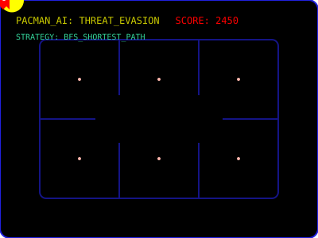

<!-- SECTION: HEADER START -->

  
  
   
  
  <!-- 3D AI Programming Bot -->
  
  
  
  
  

    
    
  

   

  <!-- HORIZONTAL TECH ARSENAL MARQUEE -->
  

    
  

   
  
  <h2 align="left">👤 About Me</h2>
  

    I am a determined <b>Software Developer and AI Specialist</b> based in South Africa, dedicated to pioneering high-impact, AI-driven solutions that address complex real-world challenges. My expertise lies at the nexus of high-performance architecture, neural computation, and premium aesthetics. 
  

  

    Whether architecting resilient cloud infrastructures or fine-tuning vision models, I strive to build "Sovereign Intelligence"—systems that are not only performant but also respect data privacy and user autonomy. I bridge the gap between abstract data and human intuition through glassmorphic, state-of-the-art UI designs.
  

<!-- SECTION: HEADER END -->

---

## 🎮 Elite AI Showroom: Pacman AI (Autonomous)

  <table border="0">
    <tr>
      <td width="60%">
        

          <b>Pacman: Arcade Deluxe Edition</b>. A fully playable, high-fidelity recreation of the 1980 classic, engineered with authentic ghost logic and modern web technologies.
        

        <ul>
          <li><b>Engine</b>: Custom JavaScript game loop (140fps) with delta-time movement and pixel-perfect collision.</li>
          <li><b>AI Logic</b>: Authentic ghost personalities (Blinky, Pinky, Inky, Clyde) using A* pathfinding.</li>
          <li><b>Features</b>: Retro CRT scanlines, particle effects, mobile touch controls, and 3-channel audio synthesis.</li>
        </ul>
        

          
          
        

      </td>
      <td width="40%">
        <!-- PLAYABLE GAME SHOWCASE -->
        
         
        <i>Click image to play the Arcade Deluxe Edition</i>
      </td>
    </tr>
  </table>

---

## 🎓 Specialized Learning & Certifications

  
<i>Continuous growth in AI, Design, and Engineering</i>

  
  <table border="0">
    <tr>
      <td align="center">
         
        <b>Data Analytics</b> 
        Google / Coursera
      </td>
      <td align="center">
         
        <b>UX Design</b> 
        Google Professional
      </td>
      <td align="center">
         
        <b>AI Engineering</b> 
        IBM Professional
      </td>
    </tr>
    <tr>
      <td align="center">
         
        <b>Professional Dev</b> 
        YES4Youth / CapaCiTi
      </td>
      <td align="center">
         
        <b>Python for Everybody</b> 
        University of Michigan
      </td>
      <td align="center">
         
        <b>Machine Learning</b> 
        DeepLearning.AI
      </td>
    </tr>
  </table>

---

## 🎯 My Mission & Vision
- 🌐 **Sovereign Intelligence**: Building autonomous systems that prioritize data privacy and user sovereignty.
- 🏗️ **Architectural Scalability**: Designing high-throughput systems using C++, .NET 8, and Rust.
- 🧪 **Predictive Mastery**: Leveraging ML to forecast outcomes and optimize resource allocation.

---

## 🎓 Academic Foundation
- **Co-founder & Developer** @ **Kivoc Dynamics Technology** (Start-up) 🚀
- **Bachelor of IT (Class of 2025)** @ **Richfield Graduate Institute of Technology**
- 🎖️ **Academic Excellence**: Achieved **DISTINCTION in Mobile App Development**
- 💼 **Enterprise Ready**: **CAPACITI Program Graduate** - Software Development Track
- 🚀 **Professional Growth**: **YES4Youth Program Participant** - Tech & Leadership Training

---

## 💎 Featured Masterpieces

### 🚦 FlowSentinel (Traffic Governance Platform)
**Staff-Level Infrastructure Engineering.** A distributed rate-limiting engine featuring "Fail-Open" resilience, Redis Lua script evaluation, and total observability.
` .NET 8 ` ` Redis ` ` Docker ` ` OpenTelemetry ` ` Lua ` ` Prometheus `

### 🤖 AI Job Market Intelligence
A premium platform for real-time job market analytics and AI resume matching.
` React ` ` FastAPI ` ` OpenAI ` ` Tailwind `

---

## 📊 GitHub Statistics

  
  

---

## 📬 Connect & Collaborate

  <table border="0">
    <tr>
      <td></td>
      <td valign="middle">
         
         
        
      </td>
    </tr>
  </table>

  
  
  

  Built with ❤️ by <b>Koketso Raphasha</b> • <b>Fire4s Team @ CAPACITI</b> • © 2026

