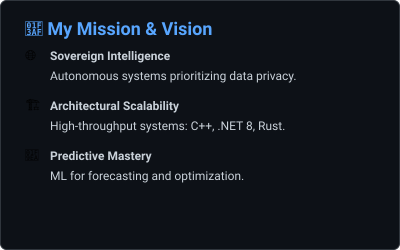
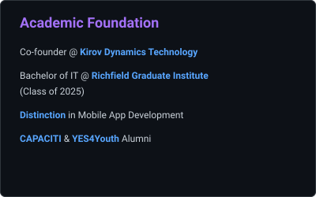

<!-- SECTION: HEADER START -->

   
  <!-- Name Banner -->
  

   

  

    ◈ Co-founder @ <b>Kivoc Dynamics Technology</b> • Bachelor of IT (Richfield Graduate) • Distinction in Mobile App Development
  

   

  

    Elite Software Developer and AI Engineer specializing in architecting high-performance systems and intelligent automation. Expertise spans full-stack web development with modern frameworks (React, Vue.js, Next.js), backend engineering (Node.js, .NET, FastAPI), and AI/ML solutions for predictive analytics and autonomous systems. Proven track record building scalable enterprise platforms, real-time reservation engines (C++, C#), and cutting-edge web applications with premium UX. Passionate about sovereign AI, data privacy, and creating systems that merge innovation, speed, and precision to solve complex challenges at scale.
  

  

    
  

  

    ⌘ Available for elite collaborations • 
    ◈ Global-scale systems • 
    ⚡ Innovation | Speed | Precision
  

   

  

    

 

  

<!-- SECTION: HEADER END -->

---

## Sovereign AI Nexus: Real-Time Status

  

 

<!-- ONE-LINE SLIDING MARQUEE: METRICS & SNAKE -->
<marquee scrollamount="8" direction="left" onmouseover="this.stop();" onmouseout="this.start();">
  
  &nbsp;&nbsp;&nbsp;&nbsp;
  
</marquee>

  

---

## Mastered Technologies &amp; Tools

  
   
  

 

## Professional Certifications & Training

  

 

## Advanced GitHub Analytics

  <!-- Mission & Academic Cards Row -->
  
  
  
    
  
  
  
  

 

## Connect & Collaborate

  <table border="0">
    <tr>
      <td></td>
      <td valign="middle">
         
         
        
      </td>
    </tr>
  </table>

  
  
  

  Built with ⚡ by <b>Koketso Raphasha</b> • <b>Fire4s Team @ CAPACITI</b> • © 2026

