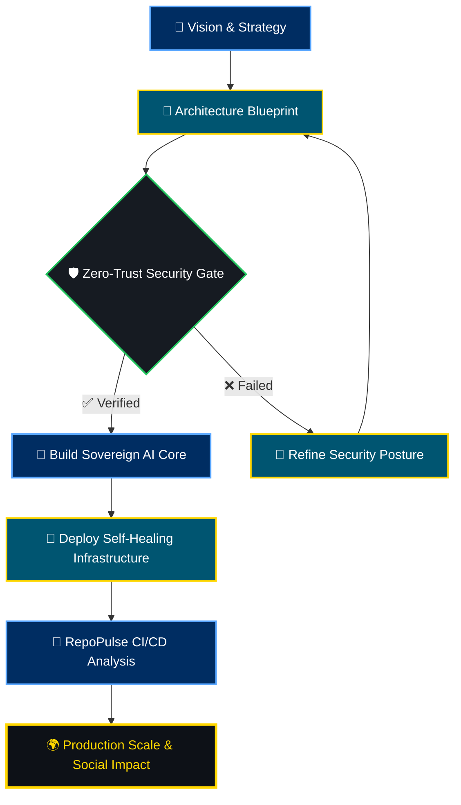

 

---

## 🌌 About Me

I am **Koketso Raphasha**, a **Systems Architect, AI Engineer, and Co-founder of Kirov Dynamics Technology** based in **Johannesburg, South Africa**.

My engineering philosophy centers around **"Sovereign Infrastructure"** and **"Autonomous Engineering."** I build self-healing, scalable, and highly efficient systems that bridge the gap between ambitious technical strategy and production-ready deployments — with a focus on economic and social impact across Africa.

**My work sits at the intersection of:**

- 🔐 **Sovereign AI Infrastructure** — Autonomous, self-correcting systems
- 🛡️ **Digital Trust & Cybersecurity** — Zero-trust, security-first delivery
- 🌐 **Distributed Architecture** — Resilient, planet-scale systems
- ⚡ **Performance Engineering** — Edge protection and deep observability
- 🧠 **Human-Centered AI** — AI that serves people, not just machines

---

## ⚙️ Engineering Workflow

My architectural approach translates vision into durable, secure, and explainable systems built for real-world impact:

---

## 🛠️ Technology Stack

**Languages & Core** 

**Web & Frameworks** 

**Infrastructure & Databases** 

**AI / ML & Security** 

 

<!-- Scrolling tech stack icons — right to left -->

  <marquee direction="left" scrollamount="10" behavior="scroll">
    
  </marquee>

---

## 🚀 Leadership & Current Focus

As **Lead Architect** across Kirov Dynamics initiatives, I drive platform direction, technical governance, and security posture across every product.

- 🏗️ Architecting sovereign infrastructure blueprints through **Kirov Dynamics Technology**
- 🤖 Leading AI integrations and trust-layer design for **Sumbandila**
- 📡 Building **RepoPulse** — an AI Operating System for autonomous GitHub CI/CD analysis
- 🌍 Advancing products from prototype energy into robust, production-grade deployments

  
  
  
  

---

## 💼 Featured Projects

| Project | Status | Focus & Direction | Role |
| :--- | :---: | :--- | :--- |
| **[🌐 Personal Portfolio](https://portfolio-react-zeta-black-48.vercel.app/)** |  | Immersive modern portfolio — engineering philosophy & work | Full-Stack Developer |
| **[🤖 RepoPulse](https://github.com/Raphasha27/RepoPulse)** |  | AI OS for GitHub portfolios; autonomous CI analysis & self-healing pipelines | Lead AI Engineer |
| **[🌍 Sumbandila-App](https://github.com/Raphasha27/Sumbandila-App)** |  | Integrated trust ecosystem & socio-economic growth platform | Architect, AI & Blockchain |
| **[🛡️ CyberShield](https://github.com/Raphasha27/CyberShield)** |  | Security operations modernization and SOC visualization tooling | Security Visualization |
| **[🏙️ KasiPass](https://github.com/Raphasha27/KasiPass)** |  | Township economy digitization & access infrastructure | Co-founder & Tech Lead |
| **[📡 FlowSentinel](https://github.com/Raphasha27/FlowSentinel)** |  | Edge protection, traffic analysis & deep observability | Performance Engineering |
| **[🦀 SupportHive-C](https://github.com/Raphasha27/SupportHive-C)** |  | Memory-safe core infrastructure in C | Core Systems Logic |

---

## 🤝 Open Source Contributions

| Project | Contribution |
| :--- | :--- |
| **[ai-chatkit](https://github.com/princedev-toptal/ai-chatkit)** | Initialized core infrastructure, CI/CD workflows & MIT License |

---

## 📈 Activity & Impact

  

 

  
  &nbsp;
  

 

  

---

## 🐍 Contribution Snake

<picture>
  <source media="(prefers-color-scheme: dark)" srcset="https://raw.githubusercontent.com/Raphasha27/Raphasha27/output/github-snake-dark.svg" />
  <source media="(prefers-color-scheme: light)" srcset="https://raw.githubusercontent.com/Raphasha27/Raphasha27/output/github-snake.svg" />
  
</picture>

---

## 🎓 Education

| Qualification | Institution | Year |
| :--- | :--- | :--- |
| **BSc in Information Technology** *(Distinction — Mobile App Development)* | Richfield Graduate Institute of Technology | 2025 |
| **12-Month ICT Learnership Programme** | CAPACITI | 2024 |

---

*"Building systems that don't just solve problems — but autonomously adapt to prevent them."*

**— Koketso Raphasha**

