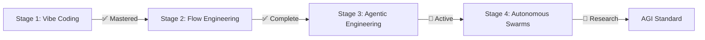
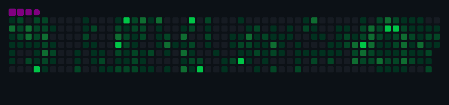

<div align="center">

<!-- Animated capsule header -->


<!-- Typing animation -->


<br/>

<!-- Social / contact badges -->
[](https://koketso-raphasha.vercel.app)
[](https://za.linkedin.com/in/koketso-raphasha-517954387)
[](mailto:raphashakoketso99@gmail.com)
[](https://wa.me/27781172470)

<br/>


</div>

---

## 👨🏾‍💻 About Me

```typescript
const koketso = {
  name:       "Koketso Raphasha",
  role:       "Full-Stack Developer & System Architect",
  company:    "Kirov Dynamics",
  education:  "BSc IT (Distinction) — Richfield Graduate Institute",
  location:   "Johannesburg, South Africa 🇿🇦",
  focus:      "AI-powered systems for the African digital economy",
  languages:  ["Python", "TypeScript", "Java", "Go", "Rust", "C"],
  currentlyBuilding: [
    "Autonomous AI agent frameworks & agentic pipelines",
    "Offline-first ecosystems for emerging markets",
    "NLP models for African languages (Zulu · Xhosa · Sotho)"
  ],
  openTo:         ["Freelance", "Full-time", "Consulting", "Collaboration"],
  responseTime:   "< 24 hours"
};
```

---

## 🎯 Mission Statement

> **Engineering autonomous frameworks, AI-powered security systems, and offline-first ecosystems for the African digital economy.**
> Every system shipped is built for **resilience**, **scalability**, and **extreme performance**.

---

## 🚀 Current Focus: Agentic Engineering



**Building Teams of Agents** with specific jobs, memory, and tools. Focusing on:
- 🤖 **Orchestration** — Multi-agent coordination
- 🧠 **Memory Management** — Persistent context & learning
- 🛠️ **Tool Integration** — External API & system access
- ⚡ **Reliability** — Error handling & self-healing

---

## 💼 Flagship Projects

### 🏦 SmartBank Enterprise Platform
**Production-grade distributed banking backend** simulating real-world fintech infrastructure.

[](https://github.com/Raphasha27/smartbank-enterprise-platform)


**8 Microservices:** API Gateway · Auth (JWT/RBAC) · Account · Transaction (ACID) · Loan · Audit · Notification · Ledger (Double-entry)

**Patterns:** Saga Pattern · Optimistic Locking · OpenTelemetry · Distributed Tracing

---

### 🛡️ CyberShield SOC

[](https://github.com/Raphasha27/cybershield_soc)


Real-time SOC dashboard with WebSocket threat streams, behavioral analytics, and SIEM integration.

---

### 🇿🇦 South African Innovation Projects

<table>
<tr>
<td width="50%">

#### ⚡ [EskomSense AI](https://github.com/Raphasha27/EskomSense-AI)
ML-powered load shedding prediction & battery optimizer

**Tech:** Python · FastAPI · ML · IoT

</td>
<td width="50%">

#### 🌤️ [Aura Weather AI](https://github.com/Raphasha27/aura-weather-ai)
AI weather forecasting with localised South African meteorological data

**Tech:** JavaScript · FastAPI · ML


</td>
</tr>
<tr>
<td width="50%">

#### 📊 [AI Job Market Intelligence](https://github.com/Raphasha27/ai-job-market-intelligence)
AI-powered job market analytics platform with trend forecasting


**Tech:** JavaScript · Python · AI

</td>
<td width="50%">

#### 🗣️ [SA Language AI](https://github.com/Raphasha27/SA-Language-AI)
NLP toolkit for Zulu, Xhosa, Afrikaans

**Tech:** Python · PyTorch · NLP

</td>
</tr>
<tr>
<td width="50%">

#### 💡 [Nexus Platform](https://github.com/Raphasha27/nexus)


</td>
<td width="50%">

#### 👨‍💻 [YouthCode ZA](https://github.com/Raphasha27/YouthCode-ZA)
Offline-first coding education for South African youth

**Tech:** Flutter · Python · AI

</td>
</tr>
</table>

---

### 🔐 Cybersecurity Labs

[](https://github.com/Raphasha27/kirov-security-core)

| Tool | Description | Language |
|------|-------------|----------|
| 🔌 [Network Port Scanner](https://github.com/Raphasha27/Network-Port-Scanner) | Multi-threaded with banner grabbing |  |
| 🔑 [Password Analyzer](https://github.com/Raphasha27/Password-Analyzer) | Entropy & NIST SP 800-63B scoring |  |
| 🌐 [Suspicious URL Checker](https://github.com/Raphasha27/Suspicious-URL-Checker) | Phishing detection & risk scoring |  |
| 🎣 [Phishing Awareness Game](https://github.com/Raphasha27/Phishing-Awareness-Game) | Gamified security training |  |
| 🌊 [DDoS Detection Simulator](https://github.com/Raphasha27/DDOS-Detection-Simulator) | Traffic simulation & alerts |  |
| 👁️ [Insider Threat Detector](https://github.com/Raphasha27/Insider-Threat-Detector) | Behavioral analytics |  |

---

### 🔥 More Live Deployments

| Project | Description | Link |
|---------|-------------|------|
| 💼 AI Business Engine | Zero-capital business playbooks | [](https://ai-business-engine.vercel.app) |
| 🏥 NoShowIQ | Healthcare no-show prediction | [](https://noshowiq-fullstack.vercel.app) |
| 🎨 Portfolio | 3D interactive portfolio | [](https://koketso-raphasha.vercel.app) |
| 🌿 Go RAG System | RAG pipeline with pgvector & agentic patterns | [](https://github.com/Raphasha27/Go-RAG-System) |
| 🔒 Ironclad Sandbox | Secure Python sandbox for AI agent execution | [](https://github.com/Raphasha27/ironclad-sandbox) |

---

## 🛠️ Technology Stack

<div align="center">


### Languages


### Frontend & Mobile


### Backend & Infrastructure


### Data, AI & Cloud


</div>

---

## 📊 GitHub Statistics

<div align="center">


&nbsp;&nbsp;


<br/><br/>


</div>

---

## 🏆 GitHub Achievements

<div align="center">

[](https://github.com/ryo-ma/github-profile-trophy)

</div>

### 🎖️ Achievement Tracker

- ✅ **Arctic Code Vault Contributor** — Code preserved in the Arctic vault
- ✅ **Pull Shark** — Opened multiple pull requests
- ✅ **Quickdraw** — Closed issues fast
- ✅ **YOLO** — Merged PRs without review (when appropriate)
- 🎯 **Starstruck** — Repository with 16+ stars *(In Progress)*
- 🎯 **Galaxy Brain** — 2 accepted answers on discussions

---

## 📈 Contribution Activity

<div align="center">


</div>

### 🐍 Contribution Snake

<div align="center">

<picture>
  <source media="(prefers-color-scheme: dark)" srcset="assets/github-contribution-grid-snake-dark.gif"/>
  <source media="(prefers-color-scheme: light)" srcset="assets/github-contribution-grid-snake.gif"/>
  
</picture>

</div>

---

## 🎓 Education & Certifications

<table>
<tr>
<td width="60%">

### 🎓 Education
- **BSc Computer Science (Distinction)** — Richfield Graduate Institute (2022–2025)
- **Software Engineering** — WeThinkCode_ Johannesburg
- **Digital Skills Accelerator** — CAPACITI

</td>
<td width="40%">

### 📜 Certifications (10+)
- ✅ AWS Certified
- ✅ Azure AZ-900
- ✅ Meta Frontend Developer
- ✅ Google Data Analytics
- ✅ Cisco Networking

</td>
</tr>
</table>

<div align="center">

</div>

---

## 💡 Quick Stats

```text
📦  194+ Public Repositories
⭐  2,200+ Stars Received
🔄  5,200+ Contributions in Last Year
🌍  Based in Johannesburg, South Africa
🏢  Founder @ Kirov Dynamics Technology
```

---

## 🎯 2026 Goals

- [ ] Reach 3,000+ GitHub stars across repositories
- [ ] Contribute to 10+ major open source projects
- [ ] Launch 3 SaaS products in production
- [ ] Earn GitHub "Starstruck" achievement
- [ ] Build AI agent with 10K+ GitHub stars
- [ ] Speak at 2 tech conferences
- [ ] Write 12 technical blog posts

---

## 🤝 Open Source Philosophy

> *"The power of open source is the power of the people. The people win."*

I believe in **building in the open**. All my projects are:
- ✅ Open for contribution
- ✅ Welcoming to feedback
- ✅ Documented for learning
- ✅ PRs always welcome

---

## 📫 Let's Connect

<div align="center">

[](https://koketso-raphasha.vercel.app)
[](mailto:raphashakoketso99@gmail.com)
[](https://za.linkedin.com/in/koketso-raphasha-517954387)
[](https://wa.me/27781172470)
[](https://twitter.com/raphasha27)

**Response time:** Usually within 24 hours
**Available for:** Freelance · Full-time · Consulting · Collaboration

</div>

---

## 💰 Support My Work

If you find my projects helpful, consider:

[](https://buymeacoffee.com/raphasha27)
[](https://github.com/sponsors/Raphasha27)

---

<div align="center">

### ⚡ *"Strive not to be a success, but rather to be of value."* — Albert Einstein


**© 2026 Koketso Raphasha** | **Founder @ Kirov Dynamics Technology**


</div>
