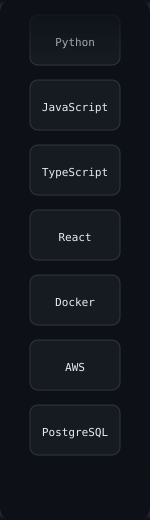
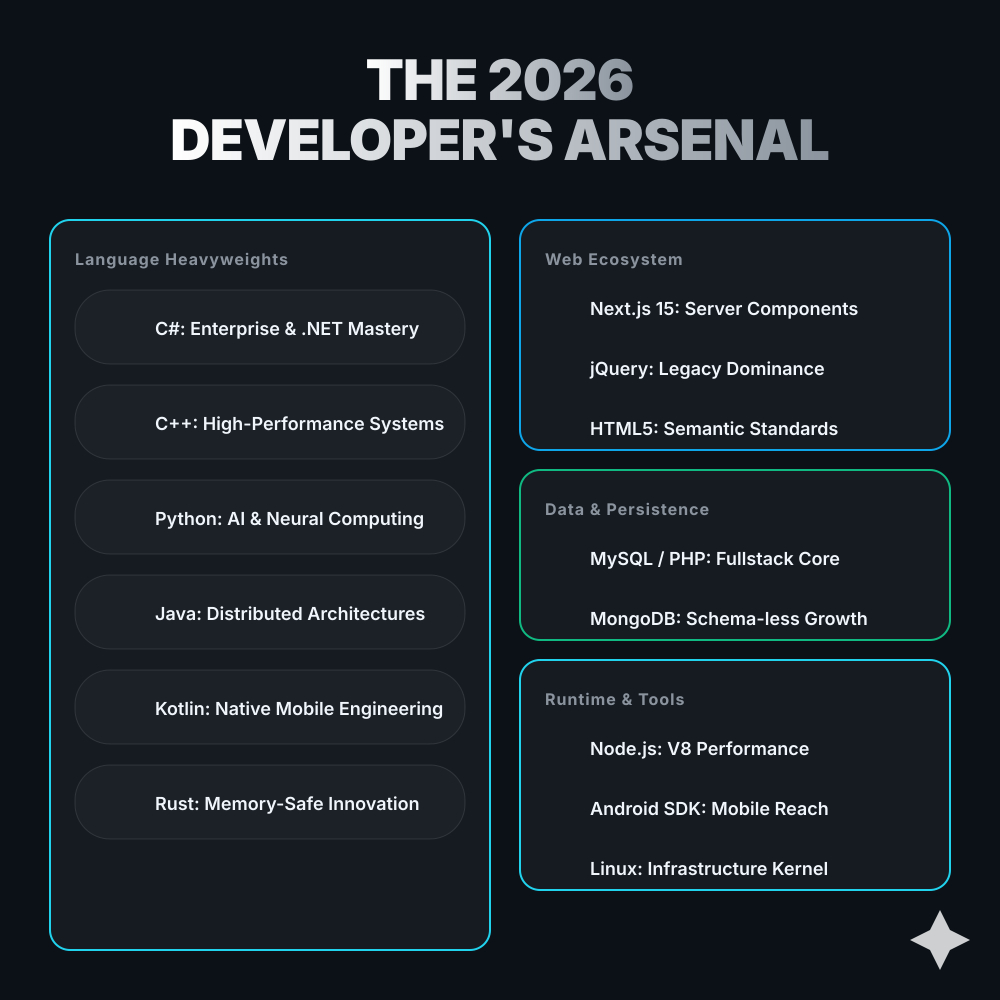

<!-- SECTION: HEADER START -->

  <!-- Banner -->
  

    

  <!-- Old Man Typing GIF -->
  

    

  
  
  

    
    
  

<!-- SECTION: HEADER END -->

---

## 🎓 Specialized Learning & Certifications

  
<i>Continuous growth in AI, Design, and Engineering</i>

  
  <table border="0">
    <tr>
      <td align="center"> Google / Coursera</td>
      <td align="center"> Google / UI/UX</td>
      <td align="center"> IBM Professional</td>
    </tr>
    <tr>
      <td align="center"> YES4Youth / CapaCiTi</td>
      <td align="center"> Univ. of Michigan</td>
      <td align="center"> DeepLearning.AI</td>
    </tr>
    <tr>
      <td align="center"> Meta / Coursera</td>
      <td align="center"> IBM / Coursera</td>
      <td align="center"> Microsoft Associate</td>
    </tr>
  </table>

---

## 🛠️ Tech Arsenals & About Me

  <!-- HORIZONTAL TECH ARSENAL MARQUEE -->
  
    

  <table border="0" width="100%">
    <tr>
      <td width="70%" valign="top">
        <h2 align="left">👤 About Me</h2>
        

          I am a determined <b>Software Developer and AI Specialist</b> based in South Africa, dedicated to pioneering high-impact, AI-driven solutions that address complex real-world challenges. My expertise lies at the nexus of high-performance architecture, neural computation, and premium aesthetics. 
        

        

          Whether architecting resilient cloud infrastructures or fine-tuning vision models, I strive to build "Sovereign Intelligence"—systems that are not only performant but also respect data privacy and user autonomy. I bridge the gap between abstract data and human intuition through glassmorphic, state-of-the-art UI designs.
        

      </td>
      <td width="30%" align="right">
        <!-- VERTICAL TECH STACK MARQUEE -->
        
      </td>
    </tr>
  </table>
  
   

  <!-- THE 2026 DEVELOPER'S ARSENAL -->
  

---

## 💎 Portfolio: 18 Production-Ready Projects

  
<i>Full-stack projects spanning 12 programming languages and frameworks</i>

### 🐍 Python Projects

| Project | Description | Live Demo |
|---------|-------------|-----------|
| **[Python AI Fraud Detection](https://github.com/Raphasha27/python-ai-fraud-detection)** | AI-powered fraud detection with XGBoost, FastAPI, and Cloudflare Workers | [GitHub Pages](https://raphasha27.github.io/python-ai-fraud-detection) · [Cloudflare](https://fraud-detection-api-3pg.pages.dev) |
| **[Python Data Engineering Platform](https://github.com/Raphasha27/python-data-engineering-platform)** | Scalable data pipelines with Apache Kafka, Spark, and Airflow | [GitHub Pages](https://raphasha27.github.io/python-data-engineering-platform) |
| **[Python RAG Knowledge Assistant](https://github.com/Raphasha27/python-rag-knowledge-assistant)** | Retrieval-Augmented Generation with ChromaDB and HuggingFace | [GitHub Pages](https://raphasha27.github.io/python-rag-knowledge-assistant) · [Cloudflare](https://rag-knowledge-assistant.pages.dev) |
| **[Python Computer Vision System](https://github.com/Raphasha27/python-computer-vision-system)** | Real-time object detection with YOLOv8, OpenCV, and PyTorch | [GitHub Pages](https://raphasha27.github.io/python-computer-vision-system) |
| **[Data Analytics Dashboard](https://github.com/Raphasha27/data-analytics-dashboard)** | Interactive data visualization with Plotly and FastAPI | [GitHub Pages](https://raphasha27.github.io/data-analytics-dashboard) · [Vercel](https://data-analytics-dashboard-alpha.vercel.app) |

### ☕ Java & Kotlin

| Project | Description | Live Demo |
|---------|-------------|-----------|
| **[Java Enterprise Banking API](https://github.com/Raphasha27/java-enterprise-banking-api)** | Enterprise banking with Spring Boot, JWT, PostgreSQL, and Redis | [GitHub Pages](https://raphasha27.github.io/java-enterprise-banking-api) |
| **[Kotlin Android Backend](https://github.com/Raphasha27/kotlin-android-backend)** | Full-stack Kotlin with Spring Boot API and Android client | [GitHub Pages](https://raphasha27.github.io/kotlin-android-backend) |

### 🟦 TypeScript & JavaScript

| Project | Description | Live Demo |
|---------|-------------|-----------|
| **[TypeScript Next.js SaaS Platform](https://github.com/Raphasha27/typescript-nextjs-saas-platform)** | Full-stack SaaS with Next.js 15, Prisma, Tailwind, and Stripe | [GitHub Pages](https://raphasha27.github.io/typescript-nextjs-saas-platform) · [Vercel](https://typescript-nextjs-saas-platform.vercel.app) |

### 🔵 Go & Rust

| Project | Description | Live Demo |
|---------|-------------|-----------|
| **[Go Distributed System](https://github.com/Raphasha27/go-distributed-system)** | High-performance microservices with Go, Gin, Kafka, and K8s | [GitHub Pages](https://raphasha27.github.io/go-distributed-system) |
| **[Rust Systems Project](https://github.com/Raphasha27/rust-systems-project)** | Systems programming with Tokio async runtime and Axum | [GitHub Pages](https://raphasha27.github.io/rust-systems-project) |

### 🟢 C# & C++

| Project | Description | Live Demo |
|---------|-------------|-----------|
| **[C# Enterprise Platform](https://github.com/Raphasha27/csharp-enterprise-platform)** | Enterprise platform with ASP.NET Core and Entity Framework | [GitHub Pages](https://raphasha27.github.io/csharp-enterprise-platform) |
| **[C++ High Performance ML](https://github.com/Raphasha27/cpp-high-performance-ml)** | High-performance ML library with CMake, Eigen, and SIMD | [GitHub Pages](https://raphasha27.github.io/cpp-high-performance-ml) |

### 🔴 Scala

| Project | Description | Live Demo |
|---------|-------------|-----------|
| **[Scala Spark Analytics](https://github.com/Raphasha27/scala-spark-analytics)** | Big data analytics with Apache Spark and Scala | [GitHub Pages](https://raphasha27.github.io/scala-spark-analytics) |
| **[Scala Akka Actors](https://github.com/Raphasha27/scala-akka-actors)** | Actor-based concurrency with Akka Typed Actors | [GitHub Pages](https://raphasha27.github.io/scala-akka-actors) |

### 🟣 Mobile & GPU Computing

| Project | Description | Live Demo |
|---------|-------------|-----------|
| **[Mobile Cross Platform](https://github.com/Raphasha27/mobile-cross-platform)** | Cross-platform apps with Flutter and React Native | [GitHub Pages](https://raphasha27.github.io/mobile-cross-platform) |
| **[CUDA ML Optimization](https://github.com/Raphasha27/cuda-ml-optimization)** | GPU-accelerated ML with custom CUDA kernels | [GitHub Pages](https://raphasha27.github.io/cuda-ml-optimization) |
| **[Julia Scientific Computing](https://github.com/Raphasha27/julia-scientific-computing)** | Scientific computing with DifferentialEquations.jl and Flux.jl | [GitHub Pages](https://raphasha27.github.io/julia-scientific-computing) |

### 🔧 DevOps

| Project | Description | Live Demo |
|---------|-------------|-----------|
| **[DevOps Automation Platform](https://github.com/Raphasha27/devops-automation-platform)** | Infrastructure automation with Terraform, Ansible, and GitHub Actions | [GitHub Pages](https://raphasha27.github.io/devops-automation-platform) |

### 🐳 Docker Hub

All 18 projects are available as Docker images: **[hub.docker.com/u/raphasha27](https://hub.docker.com/u/raphasha27)**

---

## 📊 GitHub Statistics & Real Contributions

  <!-- GitHub Stats (with count_private=true and include_all_commits=true) -->
  
  

 

  <h3>🐍 GitHub Contribution Graph (Snake)</h3>
  <picture>
    <source media="(prefers-color-scheme: dark)" srcset="https://raw.githubusercontent.com/Raphasha27/Raphasha27/output/github-contribution-grid-snake-dark.svg">
    <source media="(prefers-color-scheme: light)" srcset="https://raw.githubusercontent.com/Raphasha27/Raphasha27/output/github-contribution-grid-snake.svg">
    
  </picture>

---

## 📬 Connect & Collaborate

  <table border="0">
    <tr>
      <td></td>
      <td valign="middle">
         
         
        
      </td>
    </tr>
  </table>

  
  
  

  Built with ❤️ by <b>Koketso Raphasha</b> • <b>Fire4s Team @ CAPACITI</b> • © 2026

