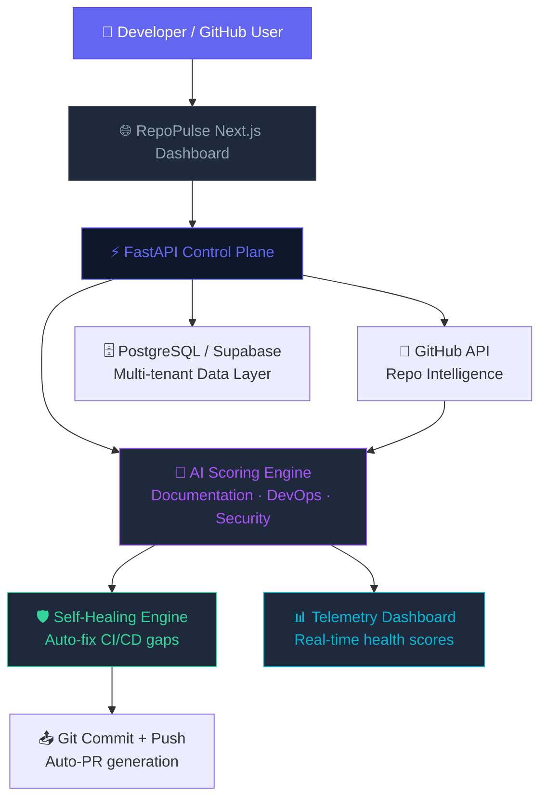
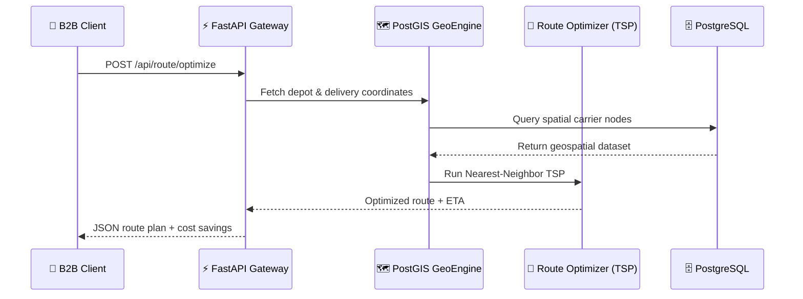

  
  
  
  

&nbsp;

---

## 🏛️ About Me

I'm a **Systems Architect**, **AI Engineer**, and **Co-Founder of Kirov Dynamics Technology** — based in Johannesburg, South Africa. My engineering philosophy is built around **"Sovereign Infrastructure"** and **"Autonomous Engineering"**: systems that observe, diagnose, and heal themselves.

| | |
|---|---|
| 🎓 | **BSc Information Technology** — Richfield Graduate Institute of Technology *(2025 Graduate, Distinction in Mobile App Development)* |
| 🏗️ | **12-Month CAPACITI ICT Learnership** — Industry-integrated software engineering @ 19 Ameshoff, Braamfontein |
| 🚀 | **Co-Founder & Systems Architect** @ Kirov Dynamics Technology |
| 🧠 | Building **RepoPulse** — The AI Operating System for GitHub Portfolios |
| 💼 | Open to **Backend / AI / DevOps Engineering** roles (Full-time & Remote) |

---

## ⚡ What I Build — Domain Breakdown

| Domain | Technologies | Flagship Projects |
|---|---|---|
| 🤖 Autonomous AI Infrastructure | Python · FastAPI · OpenAI · React | **RepoPulse**, AI-Concept-Chatbot |
| 🧭 Agentic AI & Vector DBs | Golang · PostgreSQL (pgvector) | **Go-RAG-System** |
| 🛡️ Cybersecurity & SOC | Python · SIEM · Malware Analysis | **Kirov Cybersecurity Lab**, CyberShield |
| ⚙️ Systems Programming | C · C++ · Rust | **SupportHive-C**, SeatLock Engine |
| 💳 SaaS Platforms | Next.js · FastAPI · Stripe | **Opsly SaaS**, NoShowIQ |
| 🌍 Digital Trust Infrastructure | Next.js 14 · Sovereign APIs | **Sumbandila Platform** |
| 📦 Supply Chain AI | TypeScript · FastAPI · PostGIS | **SupplyWave SA** |

---

## 🚀 The Kirov Dynamics Portfolio

> All projects are engineered for production — automated CI/CD, autonomous health monitoring, and zero-billing-noise sovereign deployment.

| Project | Stack | Description | Status |
|---|---|---|---|
| **RepoPulse** (GitGuard-AI) | Python · FastAPI · Next.js | AI DevOps Brain. Autonomous CI failure analysis, self-healing pipelines & cost reduction. | 🟢 Active (Enterprise Ready) |
| **SupplyWave SA** | TypeScript · FastAPI · PostGIS | Autonomous B2B supply chain cost-optimization & real-time logistics mesh for South Africa. | 🟢 Active |
| **AI-Concept-Chatbot** | Python · LangChain · React | Multi-agent autonomous evaluation and reflection system for complex reasoning tasks. | 🧠 Active |
| **Kirov Cybersecurity Lab** | Python · Scikit-Learn | 16+ production-grade tools including ML Anomaly Detectors and Ransomware Simulators. | 🛡️ Maintained |
| **Go-RAG-System** | Golang · pgvector | Agentic RAG architecture with intelligent Tool Calling and vector retrieval. | ⚡ Maintained |
| **SupportHive-C** | Pure C · epoll | Custom memory management and multi-threaded event loops for high-performance servers. | ⚙️ In Development |
| **Sumbandila Platform** | Next.js 14 · Sovereign APIs | Digital identity and civic inclusion platform for South Africa. | 🌍 Deployed |
| **NoShowIQ** | C# · FastAPI · ML | Intelligent appointment management & patient no-show predictive engine. | 🟢 Active |
| **Finaxis App** | Spring · Kafka | Distributed double-entry ledger core & banking microservices platform. | ⚙️ In Development |

---

## 🏗️ RepoPulse — System Architecture

---

## 📦 SupplyWave SA — Logistics Architecture

---

## 🛠️ Tech Stack & Engineering Arsenal

**AI & Data Engineering**

**Systems & Backend**

**Frontend & SaaS**

**Infrastructure & DevOps**

---

## 📈 GitHub Analytics

  
  

  

  

---

## 🐍 Contribution Activity

  <picture>
    <source media="(prefers-color-scheme: dark)" srcset="https://raw.githubusercontent.com/Raphasha27/Raphasha27/output/github-contribution-grid-snake-dark.svg"/>
    <source media="(prefers-color-scheme: light)" srcset="https://raw.githubusercontent.com/Raphasha27/Raphasha27/output/github-contribution-grid-snake.svg"/>
    
  </picture>

---

## 🧠 Engineering Philosophy

> *"Green pipelines hide real failures. Autonomous systems heal them."*

In late 2025, I transitioned from academic excellence *(graduating with distinction)* to architecting enterprise-grade platforms. Today, I build systems that don't just run code — they **observe, diagnose, and optimize themselves.**

From raw memory management in C (`SupportHive-C`) to high-level multi-agent reflection loops (`RepoPulse`), my goal is to construct the **foundational infrastructure for the African Digital Future**.

---

**🌍 Johannesburg, South Africa &nbsp;|&nbsp; 📧 raphashakoketso69@gmail.com &nbsp;|&nbsp; 🏢 CAPACITI Learner**

