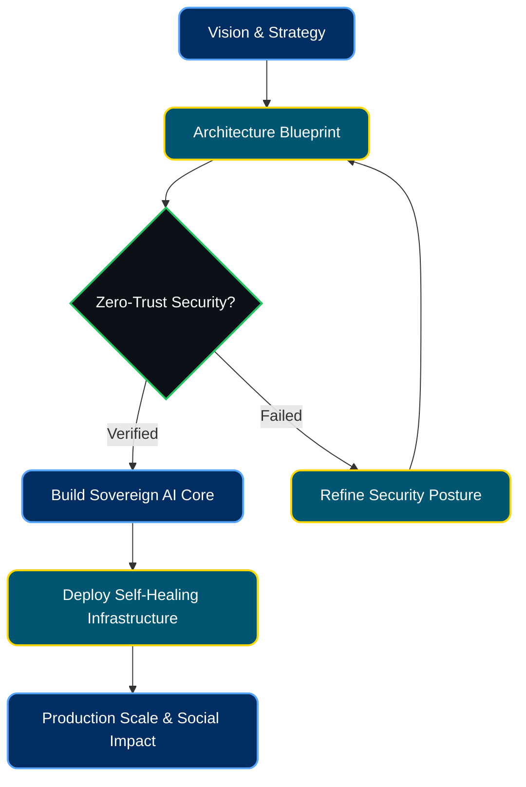
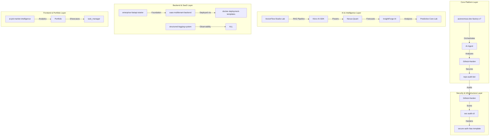

 

---

## 🌌 About Me

I am **Koketso Raphasha**, a **Systems Architect, AI Engineer, and Co-founder of Kirov Dynamics Technology** based in **Johannesburg, South Africa**.

My engineering philosophy centers around **"Sovereign Infrastructure"** and **"Autonomous Engineering."** I build self-healing, scalable, and highly efficient systems that bridge the gap between ambitious technical strategy and production-ready deployments — with a focus on economic and social impact across Africa.

**My work sits at the intersection of:**

- 🔐 **Sovereign AI Infrastructure** — Autonomous, self-correcting systems
- 🛡️ **Digital Trust & Cybersecurity** — Zero-trust, security-first delivery
- 🌐 **Distributed Architecture** — Resilient, planet-scale systems
- ⚡ **Performance Engineering** — Edge protection and deep observability
- 🧠 **Human-Centered AI** — AI that serves people, not just machines
- 📊 **Data Engineering & Analytics** — Building pipelines, exploring datasets, and competing on Kaggle

---

## ⚙️ Engineering Workflow

My architectural approach translates vision into durable, secure, and explainable systems built for real-world impact:

---

## 🛠️ Technology Stack

**Languages & Core** 

**Web & Frameworks** 

**Infrastructure & Databases** 

**AI / ML & Security** 

**Data Engineering & Analytics** 

 

<!-- Scrolling tech stack icons — right to left -->

  

---

## 🚀 Leadership & Current Focus

As **Lead Architect** across Kirov Dynamics initiatives, I drive platform direction, technical governance, and security posture across every product.

- 🏗️ Architecting sovereign infrastructure blueprints through **Kirov Dynamics Technology**
- 🤖 Leading AI integrations and trust-layer design for **Sumbandila**
- 📡 Building **RepoPulse** — an AI Operating System for autonomous GitHub CI/CD analysis
- 🌍 Advancing products from prototype energy into robust, production-grade deployments

  
  
  
  

---

## 💼 Featured Projects

| Project | Status | Focus & Direction | Role |
| :--- | :---: | :--- | :--- |
| **[🌐 Personal Portfolio](https://portfolio-iota-eight-90.vercel.app/)** |  | Immersive 3D portfolio — engineering philosophy & work | Full-Stack Developer |
| **[🛡️ Github-Harden](https://github.com/Raphasha27/Github-Harden)** |  | Multi-language security framework for repo hardening & automated auditing | Lead Security Engineer |
| **[🤖 AI-Agent](https://github.com/Raphasha27/AI-Agent)** |  | Autonomous agentic framework for cross-repo orchestration | Lead AI Engineer |
| **[🏭 autonomous-dev-factory-v7](https://github.com/Raphasha27/autonomous-dev-factory-v7)** |  | Multi-agent autonomous engineering swarm platform | Systems Architect |
| **[🔐 secure-auth-rbac-template](https://github.com/Raphasha27/secure-auth-rbac-template)** |  | Production-grade FastAPI auth & RBAC with JWT | Security Engineer |
| **[🧠 ai-job-market-intelligence](https://github.com/Raphasha27/ai-job-market-intelligence)** |  | AI job market analytics with heuristic trend forecasting | AI Engineer |
| **[📊 Nexus-Quant](https://github.com/Raphasha27/Nexus-Quant)** |  | Quantitative trading & market analytics engine | Quant Developer |
| **[💼 SaaS Multi-Tenant Backend](https://github.com/Raphasha27/saas-multitenant-backend)** |  | Enterprise multi-tenant FastAPI with tenant isolation | Backend Architect |
| **[🚀 enterprise-fastapi-starter](https://github.com/Raphasha27/enterprise-fastapi-starter)** |  | Production-ready FastAPI starter with Docker, PostgreSQL & CI/CD | Backend Architect |
| **[🔍 repo-audit-bot](https://github.com/Raphasha27/repo-audit-bot)** |  | CLI tool that audits repos for missing security files | Security Engineer |
| **[🦀 Kirov-AI-SDK](https://github.com/Raphasha27/Kirov-AI-SDK)** |  | Python SDK for building & deploying AI agents with tool calling | AI Engineer |
| **[📝 ai-prompt-cli](https://github.com/Raphasha27/ai-prompt-cli)** |  | CLI for crafting & executing AI prompts across LLM providers | AI Engineer |
| **[📊 structured-logging-system](https://github.com/Raphasha27/structured-logging-system)** |  | Enterprise-grade structured JSON logging for Python | Backend Engineer |
| **[🐳 docker-deployment-templates](https://github.com/Raphasha27/docker-deployment-templates)** |  | Production-ready Docker Compose templates for common stacks | DevOps Engineer |
| **[🔎 sec-audit-cli](https://github.com/Raphasha27/sec-audit-cli)** |  | CLI dependency vulnerability scanner for requirements.txt | Security Engineer |
| **[📋 task_manager](https://github.com/Raphasha27/task_manager)** |  | Professional task orchestration & productivity engine | Full-Stack Developer |
| **[🧪 InsightForge-AI](https://github.com/Raphasha27/InsightForge-AI)** |  | AI-powered analytics for pattern detection & BI workflows | Data Scientist |
| **[📈 Predictive-Core-Lab](https://github.com/Raphasha27/Predictive-Core-Lab)** |  | Predictive modeling & ML experimentation lab | ML Engineer |
| **[📦 VectorFlow-Studio-Lab](https://github.com/Raphasha27/VectorFlow-Studio-Lab)** |  | Vector search & RAG pipeline experimentation lab | AI Engineer |

---

## 📊 Data Engineering & Kaggle

  
    
  

I am actively expanding into **data engineering** — building end-to-end data pipelines, exploring real-world datasets, and competing in Kaggle competitions. My focus areas:

- 🗄️ **Data Pipeline Engineering** — ETL/ELT workflows, data cleaning, and feature engineering
- 📈 **Exploratory Data Analysis** — Deep dives into complex datasets using pandas, numpy, and visualization
- 🤖 **ML & Predictive Modeling** — scikit-learn, feature selection, and model evaluation
- 🏆 **Kaggle Competitions** — Entering Tabular Playground, Titanic, Housing, and advancing into NLP/Time Series

### 📌 Kaggle & Data Engineering Progress

- [x] Build Titanic ML competition notebook (EDA + feature engineering + ensemble)
- [x] Build ETL pipeline project (CSV → PostgreSQL with validation & cleaning)
- [x] Build PySpark ETL pipeline (distributed big data processing)
- [x] Build Streamlit dashboard (interactive Titanic ML predictions)
- [x] Add Kaggle badge & profile links to portfolio
- [x] Kaggle notebook (.ipynb) created and ready for upload
- [x] Submit first Kaggle competition entry ✅ **78.5% public LB**
- [x] Submit 5 competition entries (v2→v7, best: v6 at 78.5%)
- [x] Build API Data Pipeline project (public API → transformation → load)
- [x] Publish Kaggle notebook — [Titanic EDA + Ensemble 78.5%](https://www.kaggle.com/code/raphasha27/titanic-eda-ensemble-78-5)
- [x] Publish Kaggle notebook — [House Prices Regression](https://www.kaggle.com/code/raphasha27/house-prices-regression-ensemble)
- [x] Publish Kaggle notebook — [Spaceship Titanic Classification](https://www.kaggle.com/code/raphasha27/spaceship-titanic-classification-ensemble)
- [x] Publish Kaggle notebook — [F1 Pit Stops ROC AUC](https://www.kaggle.com/code/raphasha27/predicting-f1-pit-stops-roc-auc)
- [ ] Achieve Kaggle Contributor badge (need 2 more competitions)

<!-- GitHub Stats -->
## 📈 GitHub Analytics

  
  
   
  
   
  

---

## 🏗️ Unified Engineering Ecosystem

My repositories are designed as an interconnected platform — not isolated projects. Each serves a specific layer in the autonomous engineering stack:

**Key Integrations:**
- 🔄 **Autonomous PR Generator** — AI-generated improvements across all repos
- 📊 **Ecosystem Command Center** — Central health dashboard
- 🧠 **GitHub Intelligence Engine** — Repo scoring & growth recommendations
- 📝 **AI README Studio** — Automated documentation generation
- ⏰ **Contribution Orchestrator** — Smart scheduling & rotation

---

## 🏆 GitHub Trophies

  

---

## 🤝 Open Source Contributions

| Project | Contribution |
| :--- | :--- |
| **[ai-chatkit](https://github.com/princedev-toptal/ai-chatkit)** | Initialized core infrastructure, CI/CD workflows & MIT License |

---

## 🐍 Contribution Snake

<picture>
  <source media="(prefers-color-scheme: dark)" srcset="https://raw.githubusercontent.com/Raphasha27/Raphasha27/output/github-snake-dark.svg" />
  <source media="(prefers-color-scheme: light)" srcset="https://raw.githubusercontent.com/Raphasha27/Raphasha27/output/github-snake.svg" />
  
</picture>

---

## 🎓 Education

| Qualification | Institution | Year |
| :--- | :--- | :--- |
| **BSc in Information Technology** *(Distinction — Mobile App Development)* | Richfield Graduate Institute of Technology | 2025 |
| **12-Month ICT Learnership Programme** | CAPACITI | 2024 |

---

---

## 📊 Latest Repository Activity

<!-- REPO_STATS:START -->
<!-- REPO_STATS:END -->

*Updated weekly via [RepoPulse Stats Generator](.github/workflows/repo-stats.yml)*

---

*"Building systems that don't just solve problems — but autonomously adapt to prevent them."*

**— Koketso Raphasha**

