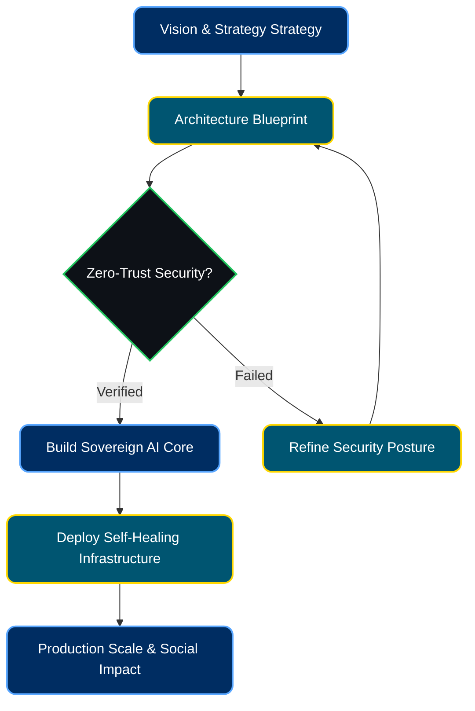

  
  
  
  
  

---

## 🌌 About Me

I am **Koketso Raphasha**, a **Systems Architect, AI Engineer, and Co-founder of [Kirov Dynamics](#)** based in **Johannesburg, South Africa**. 

My engineering philosophy centers around **"Sovereign Infrastructure"** and **"Autonomous Engineering."** I focus on creating self-healing, scalable, and highly efficient systems that bridge the gap between complex technical strategy and production-ready deployments.

**My work sits at the intersection of:**
- 🔐 **Sovereign AI Infrastructure**
- 🛡️ **Digital Trust Systems & Cybersecurity**
- 🌐 **Distributed Architecture**
- ⚡ **Performance-Focused Engineering**
- 🧠 **Human-Centered AI Interaction**

---

## ⚙️ Engineering Workflow

I focus on turning ambitious product visions into durable, secure, and explainable architectures built for real social and economic impact. Here is an illustration of my architectural approach to building autonomous systems:

---

## 🛠️ Technology Stack & Ecosystem

  
**Languages & Core Tech** 

**Web & Frameworks** 

**Infrastructure & Databases** 

**AI / ML** 

 

  <marquee direction="left" scrollamount="12" behavior="scroll">
    
  </marquee>

---

## 🚀 Leadership & Current Focus

As the **Lead Architect** across core initiatives, my oversight includes platform direction, technical review quality, and system security posture.

*   Architecting sovereign infrastructure blueprints through **Kirov Dynamics**.
*   Leading technical governance and AI integrations for **Sumbandila**.
*   Building AI-assisted systems that balance utility, empathy, and security.
*   Advancing project maturity from prototype energy into robust production discipline.

  
  
  

---

## 💼 Featured Projects

| Project | Status | Focus / 2026 Direction | My Role |
| :--- | :--- | :--- | :--- |
| **[Personal Portfolio](https://portfolio-iota-eight-90.vercel.app/)** | **Deployed (Live)** | Immersive, modern portfolio showcasing my engineering philosophy | Full-Stack Developer |
| **[RepoPulse](https://github.com/Raphasha27/RepoPulse)** | **Deployed** | AI OS for GitHub portfolios; autonomous CI analysis & self-healing | Lead AI Engineer |
| **[Sumbandila-App](https://github.com/Raphasha27/Sumbandila-App)** | **Deployed** | Integrated trust ecosystem & socio-economic growth | Architect, AI & Blockchain |
| **[CyberShield](https://github.com/Raphasha27/CyberShield)** | **Deployed** | Security operations modernization and SOC tooling | Security Visualization |
| **[KasiPass](https://github.com/Raphasha27/KasiPass)** | **Deployed** | Township economy digitization & access | Co-founder & Tech Lead |
| **[FlowSentinel](https://github.com/Raphasha27/FlowSentinel)** | **Deployed** | Edge protection and deep observability | Performance Engineering |
| **[SupportHive-C](https://github.com/Raphasha27/SupportHive-C)** | **Deployed** | Memory-safe core infrastructure | Core Systems Logic |

---

## 🤝 Open Source Contributions

| Project | Status | Contribution Focus | My Role |
| :--- | :--- | :--- | :--- |
| **[ai-chatkit](https://github.com/princedev-toptal/ai-chatkit)** |  | Initialized core project infrastructure, CI/CD workflows, and added MIT License | Open Source Contributor |

---

## 📈 Activity & Impact

  

 

  

---

## 🎓 Education

- **BSc in Information Technology** – Richfield Graduate Institute of Technology *(Graduating 2025)*
  - *Distinction in Mobile App Development*
- **ICT Learnership Programme** – CAPACITI (12-month intensive)

---

  <i>"Building systems that don't just solve problems, but autonomously adapt to prevent them."</i>

