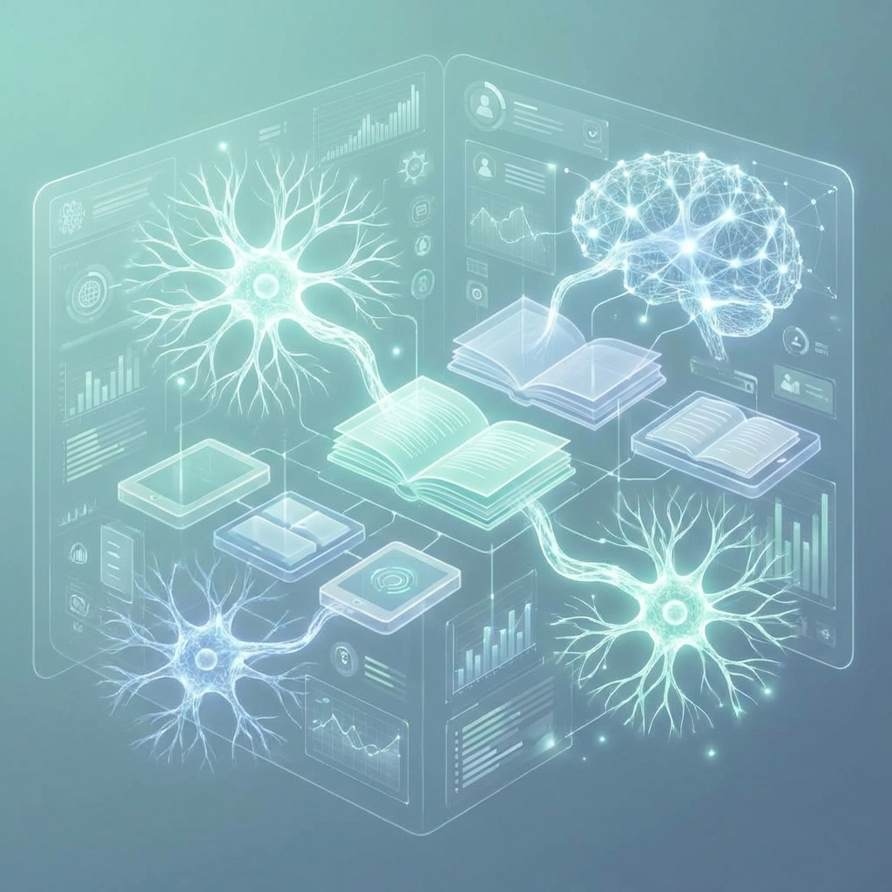
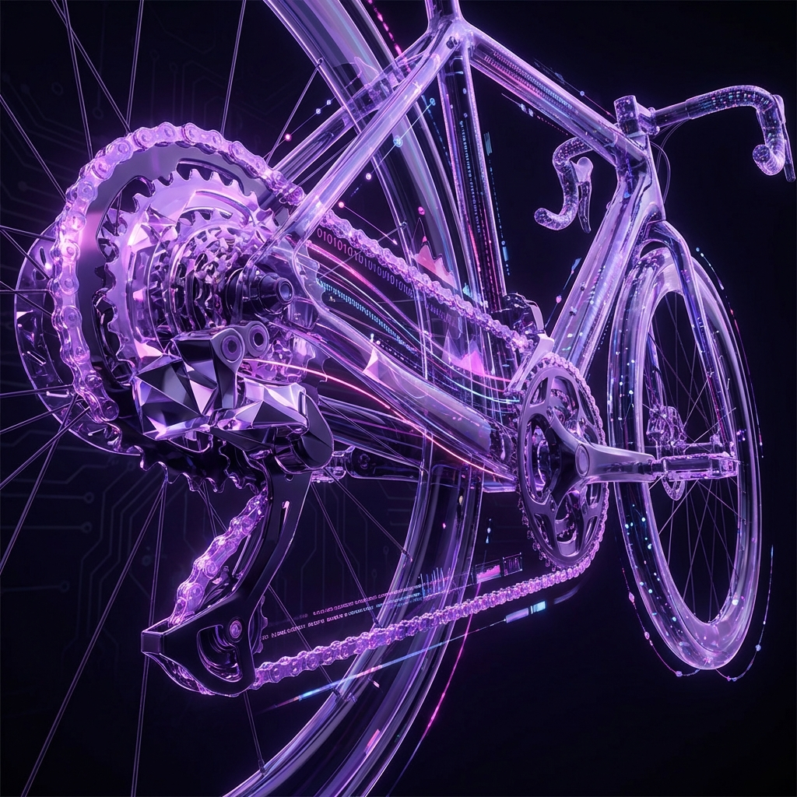
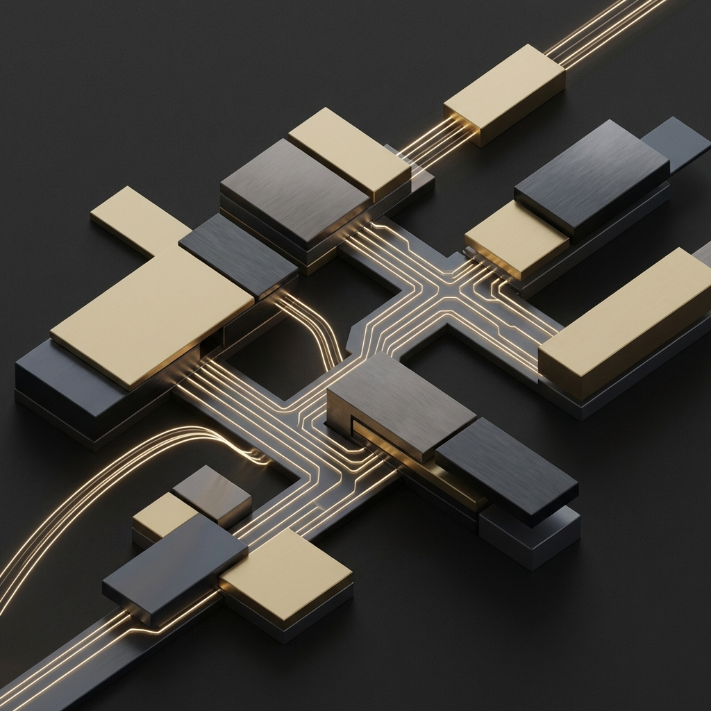

<!-- SECTION: HEADER START -->

  
  
  
  

    
    
  

  ---
  
  *"Building intelligent systems that bridge the gap between complex data and human intuition."*

<!-- SECTION: HEADER END -->

<!-- SECTION: ABOUT ME START -->
## 🌌 About Me

I am a determined **Software Developer and AI Specialist** based in South Africa, passionate about creating high-impact, AI-driven solutions that solve real-world problems. Whether it's building sovereign AI nodes, modernizing SOC platforms, or developing enterprise-grade systems, I thrive at the intersection of performance, innovation, and aesthetics.

### 🎓 Experience & Achievements
- **Co-founder & Developer** @ **Kid of Dynamics** (Start-up) 🚀
- **Bachelor of Information Technology** (Class of 2025) @ **Richfield Graduate Institute of Technology**
- 🏆 Achieved **DISTINCTION in Mobile App Development**
- 💼 **CAPACITI Program Graduate** - Enterprise Software Development Track
- 📜 **Google Professional Certificates** via **Coursera**
- 🚀 **YES4Youth Program** - Professional Development & Training
- 🌟 Completed intensive training in **.NET, React, Cloud Architecture, and AI/ML**

### 🤝 Team Collaboration & Leadership

- 👥 **Proud Member of Fire4s Development Team** @ CAPACITI
- 🚀 Collaborative team player who values collective success and knowledge sharing
- 💡 Experienced in agile development, code reviews, and pair programming
- 🎯 Contributed to multiple group projects focusing on mobile apps, web platforms, and AI solutions
- 📚 Mentored junior developers in React Native, .NET, and cloud deployment

### 🔬 Core Competencies
- 🧪 Deeply invested in **Neural Networks**, **Computer Vision**, and **Autonomous Systems**
- 🛠️ Recently shipped **FlowSentinel**, an enterprise-grade distributed rate-limiting platform
- 🏗️ Architected **NoShowIQ**, a healthcare no-show prediction system using ML
- 🎨 Expert in building **premium glassmorphic UIs** with modern frameworks
- ⚡ Performance optimization specialist with focus on **high-throughput systems**

### 📂 Portfolio Highlights
My repositories showcase a diverse range of skills from AI/ML to full-stack development:
- 🚦 **FlowSentinel** - Traffic governance with Redis Lua & OpenTelemetry
- 🤖 **AI Job Market Intelligence** - Real-time analytics & resume matching
- 🛡️ **CyberShield Modern** - SOC dashboard with AI Sentinel
- ☀️ **Aura Weather AI** - Climate insights with glassmorphic UI
- 🌍 **Sovereign AI Nexus** - Decentralized AI computing ecosystem
- 🏥 **NoShowIQ** - Healthcare ML prediction platform
- 💺 **SeatLock** - High-performance C++ reservation engine
- 🎫 **SupportHive-C** - Multi-tenant ticketing system in C

*All repositories are public and showcase production-ready code with comprehensive documentation.*

<!-- SECTION: ABOUT ME END -->

<!-- SECTION: TECH STACK START -->
---

## 🛠️ Technology Stack & Arsenal

### 🧠 AI & Intelligent Systems

### 💻 Core Backend & Logic

### 🎨 Web & Mobile Architecture

### 🚀 Cloud, DevOps & SecOps

### 📚 Proficiency & Mastery

| Skill | Proficiency |
| :--- | :--- |
| **C# / .NET Ecosystem Mastery** | **95%** |
| **AI / Machine Learning (PyTorch/TensorFlow)** | **90%** |
| **Mobile Development (React Native/MAUI)** | **85%** |
| **Cloud & DevOps (Docker/K8s/AWS)** | **92%** |

<!-- SECTION: TECH STACK END -->

<!-- SECTION: FEATURED PROJECTS START -->
---

## 💎 Featured Masterpieces

<table border="0">
  <tr>
    <td colspan="2">
      <h3>🚦 FlowSentinel (Traffic Governance Platform)</h3>
      
<b>Staff-Level Infrastructure Engineering</b>. A high-performance distributed rate-limiting engine featuring "Fail-Open" resilience, Redis Lua token buckets, and a glassmorphic Command Center.

      
       
       
      <code>.NET 8</code> <code>Redis</code> <code>Docker</code> <code>OpenTelemetry</code> <code>Lua</code> <code>Prometheus</code>
    </td>
  </tr>
  <tr>
    <td width="50%">
      <h3>🤖 AI Job Market Intelligence</h3>
      
A premium platform for real-time job market analytics and AI resume matching.

      
       
      <code>React</code> <code>FastAPI</code> <code>OpenAI</code> <code>Tailwind 4</code>
    </td>
    <td width="50%">
      <h3>🛡️ CyberShield Modern</h3>
      
Next-gen Security Operations Center dashboard with AI Sentinel integration.

      
       
      <code>Angular</code> <code>Tailwind</code> <code>D3.js</code> <code>WebSockets</code>
    </td>
  </tr>
  <tr>
    <td width="50%">
      <h3>☀️ Aura Weather AI</h3>
      
Hyper-visual weather forecast app with glassmorphic UI and climate insights.

      
       
      <code>Vite</code> <code>Vanilla CSS</code> <code>Framer Motion</code>
    </td>
    <td width="50%">
      <h3>🌍 Sovereign AI Nexus</h3>
      
Decentralized AI ecosystem for high-performance computing and secure data nodes.

      
       
      <code>Python</code> <code>Rust</code> <code>Docker</code> <code>gRPC</code>
    </td>
  </tr>
</table>

<!-- SECTION: FEATURED PROJECTS END -->

---

## 🏆 Professional Achievements & Trophies

  

---

## 📊 GitHub Statistics & Activity

  
  

  

---

## 📌 Pinned Repositories

  

### 🗂️ All Public Repositories
*All repositories are set to public visibility and showcase production-ready code:*

#### 🚀 Enterprise & Infrastructure
- **[FlowSentinel](https://github.com/Raphasha27/flowsentinel)** - Distributed rate-limiting engine with Redis Lua & OpenTelemetry
- **[SeatLock](https://github.com/Raphasha27/seatlockengine)** - High-performance C++ reservation system with lock-free architecture
- **[SupportHive-C](https://github.com/Raphasha27/supporthive-c)** - Multi-tenant ticketing system built in C

#### 🤖 AI & Machine Learning
- **[NoShowIQ](https://github.com/Raphasha27/noshowiq)** - Healthcare no-show prediction with .NET 8 & FastAPI ML engine
- **[AI Job Market Intelligence](https://github.com/Raphasha27/ai-job-market)** - Real-time job analytics with AI resume matching
- **[Sovereign AI Nexus](https://github.com/Raphasha27/sovereign-ai-nexus-v2)** - Decentralized AI computing ecosystem

#### 🛡️ Security & Monitoring
- **[CyberShield Modern](https://github.com/Raphasha27/cybershield-modern)** - Next-gen SOC dashboard with Angular & D3.js
- **[CyberShield SOC](https://github.com/Raphasha27/cybershield-soc)** - Security Operations Center platform

#### 🌦️ Web Applications
- **[Aura Weather AI](https://github.com/Raphasha27/aura-weather-ai)** - Hyper-visual weather app with climate insights
- **[CONVO](https://github.com/Raphasha27/convo)** - Real-time chat application

#### 📱 Mobile Development
- **[Afro Fashion Mobile](https://github.com/Raphasha27/afro-fashion-mobile)** - E-commerce mobile app for African fashion

#### 📊 Data & Analytics
- **[Certificate Verification System](https://github.com/Raphasha27/certificate-verification-sql)** - SQL database project with advanced features
- **[Billboard Project](https://github.com/Raphasha27/billboard)** - Professional billboard design system

---

## 📈 Contribution Activity

  

---

## 📬 Connect & Collaborate

  
I'm always open to collaborating on innovative projects, discussing tech, or exploring new opportunities!

  
  
  
  

    

  
  
  

  Built with ❤️ by <b>Koketso Raphasha</b> • Fire4s Team @ CAPACITI • © 2026

